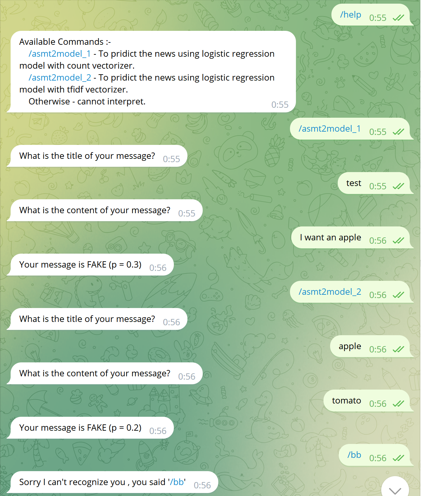

# Chatbot-to-Detect-Fake-News

This is a chatbot based on Telegram to detect fake news. 

## Table of Contents

- [Background](#background)
- [Usage](#usage)

## Background
We are going to detect whether the title and message is real or fake with Telegram Bot. Data source has a
shape of 7796×4. The first column identifies the news, the second and third are the title and
text, and the fourth column has labels denoting whether the news is “REAL” or “FAKE”.

### Project Structure
- ``model_train.ipynb`` contains the programs for data preparations and training the model. If you would like to use other models, please modify them here.
- Two ``.pkl`` files store trained models, which are both **Logistic Regression Models** but the pipeline are building up using sklearn’s **CounterVectorizer** and **TfidfVectorizer** respectively.
- ``news.csv`` file is our dataset for training, which can also be downloaded from [kaggle](https://www.kaggle.com/datasets/hassanamin/textdb3). 
- ``teleConfig.py`` file stores our telegram services.

## Usage
1. Replace the ``your_token`` field in line 81 of ``teleConfig.py`` with your bot's token. It should be some string like ``110201543:AAHdqTcvCH1vGWJxfSeofSAs0K5PALDsaw``. If you haven't have a token, see [here](https://core.telegram.org/bots/features#botfather) for help and create one. 
2. Run ``teleConfig.py``.
3. Open Telegram app, find your own bot, send messages to your bot. 

### Simple Demonstration

